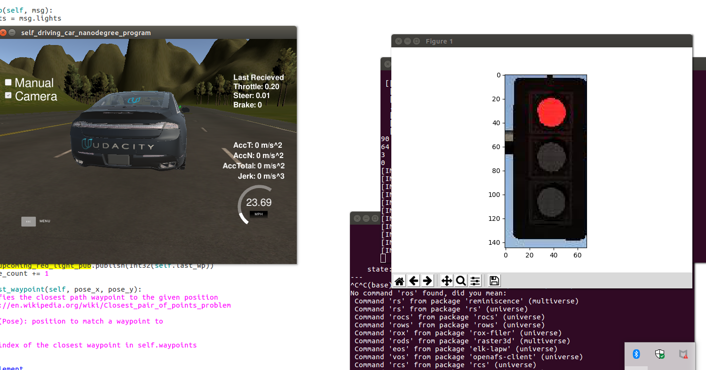

# Self-Driving Car Engineer Capstone Project

Member: Francisco  Nauber Bernardo Gois


Link of video: https://www.youtube.com/watch?v=J63XneztDAA


# System Architecture Diagram

For this project, you'll be writing ROS nodes to implement core functionality of the autonomous vehicle system, including traffic light detection, control, and waypoint following! You will test your code using a simulator, and when you are ready, your group can submit the project to be run on Carla.

The following is a system architecture diagram showing the ROS nodes and topics used in the project. You can refer to the diagram throughout the project as needed. The ROS nodes and topics shown in the diagram are described briefly in the **Code Structure** section below, and more detail is provided for each node in later classroom concepts of this lesson.


# Code Structure

Below is a brief overview of the repo structure, along with descriptions of the ROS nodes. The code that you will need to modify for the project will be contained entirely within the `(path_to_project_repo)/ros/src/` directory. Within this directory, you will find the following ROS packages:

## (path_to_project_repo)/ros/src/tl_detector/

This package contains the traffic light detection node: `tl_detector.py`. This node takes in data from the `/image_color`, `/current_pose`, and `/base_waypoints` topics and publishes the locations to stop for red traffic lights to the `/traffic_waypoint` topic.

The `/current_pose` topic provides the vehicle's current position, and `/base_waypoints` provides a complete list of waypoints the car will be following.

You will build both a traffic light detection node and a traffic light classification node. Traffic light detection should take place within `tl_detector.py`, whereas traffic light classification should take place within `../tl_detector/light_classification_model/tl_classfier.py`.


## (path_to_project_repo)/ros/src/waypoint_updater/

This package contains the waypoint updater node: `waypoint_updater.py`. The purpose of this node is to update the target velocity property of each waypoint based on traffic light and obstacle detection data. This node will subscribe to the `/base_waypoints`, `/current_pose`, `/obstacle_waypoint`, and `/traffic_waypoint` topics, and publish a list of waypoints ahead of the car with target velocities to the `/final_waypoints` topic.


## (path_to_project_repo)/ros/src/twist_controller/

Carla is equipped with a drive-by-wire (dbw) system, meaning the throttle, brake, and steering have electronic control. This package contains the files that are responsible for control of the vehicle: the node `dbw_node.py` and the file `twist_controller.py`, along with a pid and lowpass filter that you can use in your implementation. The `dbw_node` subscribes to the `/current_velocity` topic along with the `/twist_cmd` topic to receive target linear and angular velocities. Additionally, this node will subscribe to `/vehicle/dbw_enabled`, which indicates if the car is under dbw or driver control. This node will publish throttle, brake, and steering commands to the `/vehicle/throttle_cmd`, `/vehicle/brake_cmd`, and `/vehicle/steering_cmd` topics.


In addition to these packages you will find the following, which are not necessary to change for the project. The `styx` and `styx_msgs` packages are used to provide a link between the simulator and ROS, and to provide custom ROS message types:

- ### (path_to_project_repo)/ros/src/styx/

  A package that contains a server for communicating with the simulator, and a bridge to translate and publish simulator messages to ROS topics.

- ### (path_to_project_repo)/ros/src/styx_msgs/

  A package which includes definitions of the custom ROS message types used in the project.

- ### (path_to_project_repo)/ros/src/waypoint_loader/

  A package which loads the static waypoint data and publishes to

   

  ```
  /base_waypoints
  ```

  .

- ### (path_to_project_repo)/ros/src/waypoint_follower/

  A package containing code from Autoware which subscribes to

   

  ```
  /final_waypoints
  ```

   

  and publishes target vehicle linear and angular velocities in the form of twist commands to the

   

  ```
  /twist_cmd
  ```

   

  topic.


## First Approach Traffic Light Classifier


The first approach used in the simulator was to use a pre-trained neural network mobilenet v.1 and cut off traffic lights. The cut signals would then be sent to a method that evaluates the amount of red, green, or yellow color in the traffic light.


The below image represents the cut off traffic light by the model




However, this approach did not pass the tests with Carla's real images, and a second approach was adopted outside the simulation mode. 

### Second Approach Traffic Light Classifier

***


The second approach was tested with Carla real images (Test of second approach [Link](./test.html) ). The second approach consists of using a ResNet V2 neural network with a custom trained with the dataset provided by Marcos Marasca  (https://github.com/marcomarasca/SDCND-Traffic-Light-Detection).


Test with real images:


***

## Testing with the simulator


Link of simulator https://github.com/udacity/CarND-Capstone/releases

***

This is the project repo for the final project of the Udacity Self-Driving Car Nanodegree: Programming a Real Self-Driving Car. For more information about the project, see the project introduction [here](https://classroom.udacity.com/nanodegrees/nd013/parts/6047fe34-d93c-4f50-8336-b70ef10cb4b2/modules/e1a23b06-329a-4684-a717-ad476f0d8dff/lessons/462c933d-9f24-42d3-8bdc-a08a5fc866e4/concepts/5ab4b122-83e6-436d-850f-9f4d26627fd9).

Please use **one** of the two installation options, either native **or** docker installation.

### Native Installation

* Be sure that your workstation is running Ubuntu 16.04 Xenial Xerus or Ubuntu 14.04 Trusty Tahir. [Ubuntu downloads can be found here](https://www.ubuntu.com/download/desktop).
* If using a Virtual Machine to install Ubuntu, use the following configuration as minimum:
  * 2 CPU
  * 2 GB system memory
  * 25 GB of free hard drive space

  The Udacity provided virtual machine has ROS and Dataspeed DBW already installed, so you can skip the next two steps if you are using this.

* Follow these instructions to install ROS
  * [ROS Kinetic](http://wiki.ros.org/kinetic/Installation/Ubuntu) if you have Ubuntu 16.04.
  * [ROS Indigo](http://wiki.ros.org/indigo/Installation/Ubuntu) if you have Ubuntu 14.04.
* Download the [Udacity Simulator](https://github.com/udacity/CarND-Capstone/releases).

### Docker Installation
[Install Docker](https://docs.docker.com/engine/installation/)

Build the docker container
```bash
docker build . -t capstone
```

Run the docker file
```bash
docker run -p 4567:4567 -v $PWD:/capstone -v /tmp/log:/root/.ros/ --rm -it capstone
```

### Port Forwarding
To set up port forwarding, please refer to the "uWebSocketIO Starter Guide" found in the classroom (see Extended Kalman Filter Project lesson).

### Usage

1. Clone the project repository
```bash
git clone https://github.com/udacity/CarND-Capstone.git
```

2. Install python dependencies
```bash
cd CarND-Capstone
pip install -r requirements.txt
```
3. Make and run styx
```bash
cd ros
catkin_make
source devel/setup.sh
roslaunch launch/styx.launch
```
4. Run the simulator

### Real world testing
1. Download [training bag](https://s3-us-west-1.amazonaws.com/udacity-selfdrivingcar/traffic_light_bag_file.zip) that was recorded on the Udacity self-driving car.
2. Unzip the file
```bash
unzip traffic_light_bag_file.zip
```
3. Play the bag file
```bash
rosbag play -l traffic_light_bag_file/traffic_light_training.bag
```
4. Launch your project in site mode
```bash
cd CarND-Capstone/ros
roslaunch launch/site.launch
```
5. Confirm that traffic light detection works on real life images

### Other library/driver information
Outside of `requirements.txt`, here is information on other driver/library versions used in the simulator and Carla:

Specific to these libraries, the simulator grader and Carla use the following:

|        | Simulator | Carla  |
| :-----------: |:-------------:| :-----:|
| Nvidia driver | 384.130 | 384.130 |
| CUDA | 8.0.61 | 8.0.61 |
| cuDNN | 6.0.21 | 6.0.21 |
| TensorRT | N/A | N/A |
| OpenCV | 3.2.0-dev | 2.4.8 |
| OpenMP | N/A | N/A |

We are working on a fix to line up the OpenCV versions between the two.
